# Rapport de projet — CSC8607 : Introduction au Deep Learning

> **Consignes générales**
> - Tenez-vous au **format** et à l’**ordre** des sections ci-dessous.
> - Intégrez des **captures d’écran TensorBoard** lisibles (loss, métriques, LR finder, comparaisons).
> - Les chemins et noms de fichiers **doivent** correspondre à la structure du dépôt modèle (ex. `runs/`, `artifacts/best.ckpt`, `configs/config.yaml`).
> - Répondez aux questions **numérotées** (D1–D11, M0–M9, etc.) directement dans les sections prévues.

---

## 0) Informations générales

- **Étudiant·e** : KHALFALLAH Riadh
- **Projet** : Classification Tiny ImageNet (200 classes) avec un réseau “Inception-like” multibranches (Dataset = Tiny ImageNet 64×64 via HuggingFace · Modèle = CNN composé de M modules Inception-like à 3 branches parallèles avec concaténation des canaux + BatchNorm )
- **Dépôt Git** : _URL publique_
- **Environnement** : `python == 3.10.19`, `torch == 2.9.1`, `cuda == 12.8`,`datasets == 4.4.2`  ,`Gpu` == NVIDIA H100 NVL MIG 1g.12gb
- **Commandes utilisées** :
  - Entraînement : `python -m src.train --config configs/config.yaml`
  - LR finder : `python -m src.lr_finder --config configs/config.yaml`
  - Grid search : `python -m src.grid_search --config configs/config.yaml`
  - Évaluation : `python -m src.evaluate --config configs/config.yaml --checkpoint artifacts/best.ckpt`

---

## 1) Données

### 1.1 Description du dataset
- **Source** (lien) :https://huggingface.co/datasets/zh-plus/tiny-imagenet
- **Type d’entrée** (image / texte / audio / séries) :`Image (RGB)`
- **Tâche** (multiclasses, multi-label, régression) :`Classification multiclasses`
- **Dimensions d’entrée attendues** (`meta["input_shape"]`) :`(3, 64, 64)`
- **Nombre de classes** (`meta["num_classes"]`) :`200`

**D1.** Quel dataset utilisez-vous ? D’où provient-il et quel est son format (dimensions, type d’entrée) ?

``` Dataset : Tiny ImageNet disponible via Hugging Face Datasets (zh-plus/tiny-imagenet)

Type : Images couleur RGB 

Dimensions d’entrée : (3, 64, 64)

Nombre de classes : 200

Repartition de données : 

100 000 :  train

10 000  : Val ( divisé en 20% test et 80% pour val )

absence de split officiel de test 
```


### 1.2 Splits et statistiques

| Split | #Exemples | Particularités (déséquilibre, longueur moyenne, etc.) |
|------:|----------:|--------------------------------------------------------|
| Train |  100 000  |   Split fourni par le dataset (Hugging Face): 500 images par classe. Équilibrage parfait.                          |
| Val   |  8000     |   Issu du split valid (80%)                   |
| Test  |  2000     |   Issu du split valid  (20%)                  |

**D2.** Donnez la taille de chaque split et le nombre de classes.  
```
Train = 100 000
Validation = 8 000
Test = 2 000
nbre de classes : 200

```

**D3.** Si vous avez créé un split (ex. validation), expliquez **comment** (stratification, ratio, seed).

```

Le dataset ne fournis pas de split test officiel donc j'ai subdivisé le split valid  pour créer 2 sous ensembles de validation et de test: 

- Afin d'assurer une évaluation équilibrée, j'ai fais  une stratification par classe.

Processus de stratification :

- Les indices des images ont été regroupés par classe (soit 50 images par classe pour les 200 classes).

- Pour chaque classe, les indices ont été mélangés aléatoirement à l'aide de la fonction torch.randperm.

- Un échantillonnage strict a été effectué : les 10 premières images de chaque classe ont été affectées au set de Test (total : 2 000 images) et les 40 suivantes au set  de Validation (total : 8 000 images).

Configuration technique :

Ratio : 80% validation / 20% test (parmi les 10 000 images du split valid initial).

- Graine aléatoire (Seed) : L'utilisation de torch.Generator().manual_seed(42) garantit que le mélange est strictement identique à chaque exécution. Cette reproductibilité est indispensable pour comparer les performances de différents modèles (comme M6) sur les mêmes données.

```
**D4.** Donnez la **distribution des classes** (graphique ou tableau) et commentez en 2–3 lignes l’impact potentiel sur l’entraînement.  
L'analyse de la distribution des classes du split train montre que le dataset est parfaitement équilibré. Chaque classe contient exactement 500 images, comme le confirme l'histogramme ci-dessous :


```
Impact pour l'entrainement :
- Absence de biais : Le modèle ne sera pas biaisé vers des classes majoritaires, ce qui favorise une apprentissage équitable de chaque catégorie.
- Simplification du processus : Aucune technique de rééquilibrage n'est nécessaire. L'accuracy globale sera donc un reflet fidèle de la performance réelle du modèle.

```

**D5.** Mentionnez toute particularité détectée (tailles variées, longueurs variables, multi-labels, etc.).

```

- Taille des images : toutes les images  observées sont en RGB 64×64 sauf 2 images en niveau de gris (mode='L') .
- Le dataset est parfaitement balancé (500 images/classe)
- Aucun bruit structurel majeur n'a été détecté. La résolution de 64x64 est cohérente avec les standards de Tiny ImageNet et parfaitement adaptée aux architectures convolutionnelles 

```

### 1.3 Prétraitements (preprocessing) — _appliqués à train/val/test_

Listez précisément les opérations et paramètres (valeurs **fixes**) :

- Vision : resize = __, center-crop = __, normalize = (mean=__, std=__)…
- Audio : resample = __ Hz, mel-spectrogram (n_mels=__, n_fft=__, hop_length=__), AmplitudeToDB…
- NLP : tokenizer = __, vocab = __, max_length = __, padding/truncation = __…
- Séries : normalisation par canal, fenêtrage = __…

**D6.** Quels **prétraitements** avez-vous appliqués (opérations + **paramètres exacts**) et **pourquoi** ?  

```

- Resize = (64, 64) : 
    - (Resize([64, 64])) : 
    - garantir une taille d’entrée uniforme (Tiny ImageNet est en 64×64, mais cela sécurise le pipeline).

- Conversion en RGB :
    -  img.convert("RGB") : 
    -  gérer les rares images non-RGB détectées (quelques images en mode L / niveaux de gris).

- ToTensor : sans param 
    - conversion PIL → tenseur PyTorch de forme (3, 64, 64), valeurs dans [0, 1].

- Normalize(mean, std) :
    -  mean = [0.485, 0.456, 0.406], std = [0.229, 0.224, 0.225] : 
    -  normalisation standard de type ImageNet pour stabiliser l’optimisation et accélérer la convergence.


```

**D7.** Les prétraitements diffèrent-ils entre train/val/test (ils ne devraient pas, sauf recadrage non aléatoire en val/test) ?

```

Non, les prétraitements ne diffèrent pas entre train/val/test : les mêmes transformations invariantes sont appliquées sur les trois splits. Aucune opération aléatoire n’est appliquée en validation/test.

```

### 1.4 Augmentation de données — _train uniquement_

- Liste des **augmentations** (opérations + **paramètres** et **probabilités**) :
  - ex. Flip horizontal p=0.5, RandomResizedCrop scale=__, ratio=__ …
  - Audio : time/freq masking (taille, nb masques) …
  - Séries : jitter amplitude=__, scaling=__ …

**D8.** Quelles **augmentations** avez-vous appliquées (paramètres précis) et **pourquoi** ?  

```

En entraînement uniquement, j’applique :

- RandomHorizontalFlip (p=0.5) : 
    - Induit une invariance à l'orientation horizontale
    - Dans bcps de classes de Tiny ImageNet (animaux, véhicules), la sémantique de l'objet ne change pas par symétrie.

- RandomCrop (size=64, padding=4) :
    - Simule des variations de cadrage et des légères translations. 
    - Le padding permet de ne pas perdre trop d'informations sur les bords tout en créant de nouvelles perspectives.

- ColorJitter léger (brightness=0.1, contrast=0.1, saturation=0.1, hue=0.02) : 
    - Apporte une robustesse aux conditions d'illumination et aux variations chromatiques (balance des blancs, exposition), très fréquentes dans les images naturelles.

```


**D9.** Les augmentations **conservent-elles les labels** ? Justifiez pour chaque transformation retenue.

```

Oui, les augmentations sont label-preserving :

- Flip horizontal ne change pas la classe (l’objet reste le même).

- Random crop avec padding faible conserve  l’objet principal (petites translations), donc l’étiquette reste valide.

- Color jitter ne modifie pas l’identité de l’objet, seulement l’apparence (éclairage/couleurs), donc l’étiquette reste la même.

```

### 1.5 Sanity-checks

- **Exemples** après preprocessing/augmentation (insérer 2–3 images/spectrogrammes) :

> 

**D10.** Montrez 2–3 exemples et commentez brièvement.  

```

Les exemples affichés du split train confirment que  :

- La normalisation utilisée pour la visualisation permet de vérifier que les images restent naturelles (couleurs et contraste plausibles) malgré la normalisation appliquée pendant l’entraînement.

- RandomCrop avec padding (4 px) est perceptible : on observe de légères variations de cadrage, ce qui simule des petites translations tout en conservant l’objet principal.

- ColorJitter introduit des variations modérées de luminosité/contraste/saturation : les objets restent reconnaissables mais l’apparence change légèrement.

- Flip horizontal a augmente la diversité sans modifier la nature de l’objet.

Ces exmples valident que les transformations d’augmentation et le preprocessing sont correctement appliqués.

```

**D11.** Donnez la **forme exacte** d’un batch train (ex. `(batch, C, H, W)` ou `(batch, seq_len)`), et vérifiez la cohérence avec `meta["input_shape"]`.

```

- Batch train (images) : torch.Size([64, 3, 64, 64])
  - batch_size = 64, canaux = 3 (RGB), hauteur = 64, largeur = 64

- Batch train (labels) : torch.Size([64])
  - un label entier par image du batch

- Cohérence avec meta["input_shape"] :
  -  meta["input_shape"] = (3, 64, 64)
  - la forme du batch est cohérente 


```

## 2) Modèle

### 2.1 Baselines

**M0.**
- **Classe majoritaire** — Métrique : `accuracy` → score = `0.005`
- **Prédiction aléatoire uniforme** — Métrique : `accuracy` → score = `0.0031`  
_Commentez en 2 lignes ce que ces chiffres impliquent._

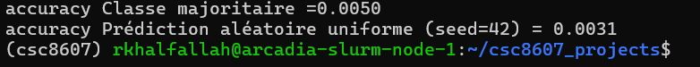

```

Ces scores sont très faibles car la tâche comporte 200 classes :
 -  un modèle non informatif se situe autour de ~0,5% d’accuracy. 
 -  Cela fixe un plancher minimal à dépasser dès les premiers essais d’entraînement
 -  le modèle doit obtenir une accuracy nettement supérieure à ces baselines pour montrer qu’il apprend réellement.

```
### 2.2 Architecture implémentée

```

- **Description couche par couche** (ordre exact, tailles, activations, normalisations, poolings, résiduels, etc.) :
  - Input → image RGB (3, 64, 64)
  - Bloc d’entrée → Conv2d(3→64, 3×3, padding=1) → ReLU
  - Bloc principal → enchaînement de M modules “Inception-like” identiques (M = 4 ou 6 ), chaque module faisant :
    - Branche 1 : Conv2d(in→64, 1×1) → ReLU
    - Branche 2 : Conv2d(in→64, 3×3, padding=1) → ReLU
    - Branche 3 : MaxPool2d(3×3, stride=1, padding=1) → Conv2d(in→64, 1×1) → ReLU
    - Concaténation des 3 branches sur les canaux → sortie 192 canaux
    - BatchNorm2d(192)
  - Réduction de résolution :
    -  si M= 4 : MaxPool2d(2×2) après le module 2 : 64×64 → 32×32
    -  Si M = 6 : MaxPool2d(2×2, stride=2) après le module 2 et après le module 4 (64×64 → 32×32 → 16×16)
  - Tête de classification :
    -  AdaptiveAvgPool2d(1×1) (Global Average Pooling) 
    -  Flatten vecteur de taille(192) →
    -  Linear(192→200) → logits

```

- **Loss function** :
  - Multi-classe : CrossEntropyLoss

- **Sortie du modèle** : forme = (batch_size, 200) (logits)

- **Nombre total de paramètres** : `492 424` si M=4 et `763528` si M = 6

**M1.** Décrivez l’**architecture** complète et donnez le **nombre total de paramètres**.  
Expliquez le rôle des **2 hyperparamètres spécifiques au modèle** (ceux imposés par votre sujet).

```

Nombre de modules M ∈ {4, 6} : contrôle la profondeur, donc la capacité du réseau. Plus M est grand, plus le modèle peut apprendre des représentations complexes (plus de non-linéarités et de niveaux de features), au prix d’un coût de calcul plus élevé et d’un risque accru de surapprentissage.

Répartition des canaux par branche branch_channels ∈ {(64,64,64), (48,72,72)} : fixe comment les 192 canaux sont distribués entre les 3 branches (1×1 / 3×3 / pool+1×1). Cela change l’équilibre entre des features plus “simples” (1×1) et des features plus “spatiales” (3×3), donc la nature des représentations apprises.

```

### 2.3 Perte initiale & premier batch

- **Loss initiale attendue** (multi-classe) ≈ `-log(1/200)`=log(200)=5.3  
- **Observée sur un batch** (64): `5.3442`
- **Vérification** : backward OK, gradients ≠ 0 (sum normes  L2 = 9.8)

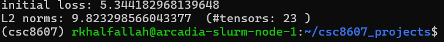

**M2.** Donnez la **loss initiale** observée et dites si elle est cohérente. Indiquez la forme du batch et la forme de sortie du modèle.

```

La loss initiale = 5.3442  est cohérente avec l’attendu 5.3 , ce qui correspond à des logits initiaux proches de 0.
Formes vérifiées : 
  - Batch d’entrée x = (64, 3, 64, 64)
  - Cibles y = (64, )
  - Sortie du modèle (logits) = (64, 200)

```

## 3) Overfit « petit échantillon »

- **Sous-ensemble train** : `N = 32` exemples
- **Hyperparamètres modèle utilisés** (les 2 à régler) : num_modules (M) = 4 , branch_channels = (64, 64, 64)
- **Optimisation** : LR = `0.01`, weight decay = `0.00001` (0 ou très faible recommandé)
- **Nombre d’époques** : `20`

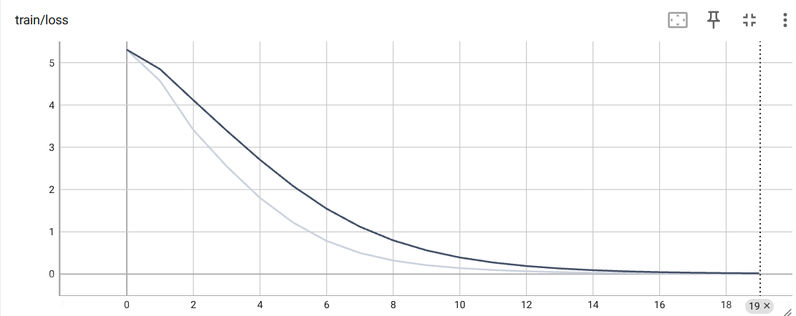

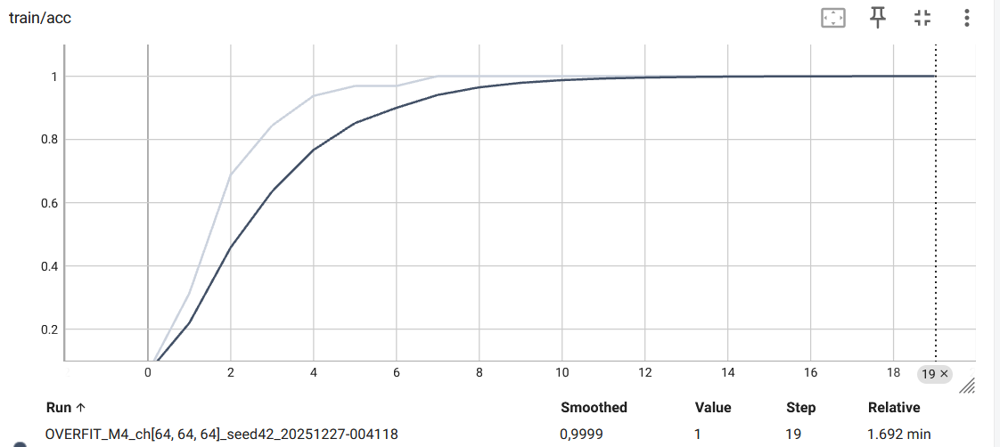


> _Insérer capture TensorBoard : `train/loss` montrant la descente vers ~0._

**M3.** Donnez la **taille du sous-ensemble**, les **hyperparamètres** du modèle utilisés, et la **courbe train/loss** (capture). Expliquez ce qui prouve l’overfit.

```

La courbe train/loss descend jusqu’à une valeur proche de 0, et train/acc atteint 1. Cela montre que le modèle mémorise complètement ce petit sous-ensemble : c’est un overfit volontaire, utilisé comme test de bon fonctionnement du pipeline (modèle + loss + optimisation).

```
---

## 4) LR finder

- **Méthode** : balayage LR (log-scale), quelques itérations, log `(lr, loss)`
- **Fenêtre stable retenue** : `1e-3 → 1e-2`
- **Choix pour la suite** :
  - **LR** = `2e-3`
  - **Weight decay** = `1e-4` (valeurs classiques : 1e-5, 1e-4)

> _Insérer capture TensorBoard : courbe LR → loss._
> 
> 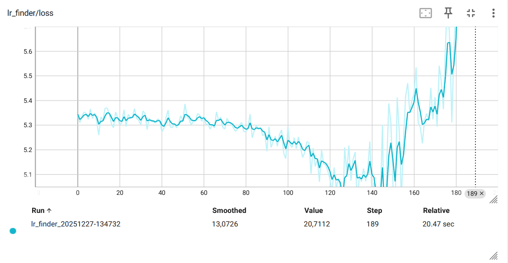
>
> 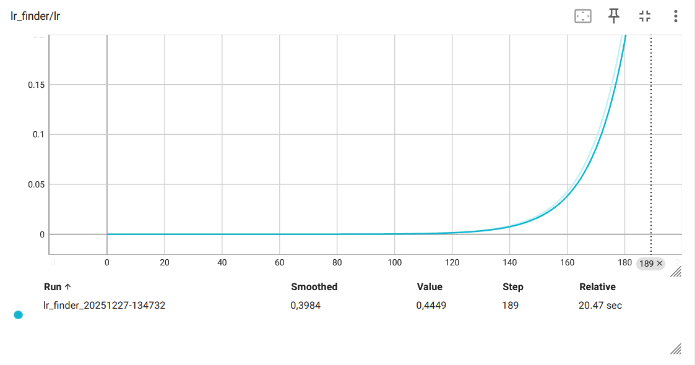

**M4.** Justifiez en 2–3 phrases le choix du **LR** et du **weight decay**.

```

Le LR finder montre une baisse nette de la loss à partir d’environ 1.6×10⁻³, avec un minimum autour de 8×10⁻³, puis une remontée marquée dès ≈ 4×10⁻² avant divergence. Pour la suite, j’ai retenu un LR conservateur au sein de la zone stable, LR = 2×10⁻³, afin d’assurer une descente efficace sans instabilité. J’utilise weight decay = 1e-4 comme régularisation légère afin de limiter légèrement l’overfit.

```

---

## 5) Mini grid search (rapide)

- **Grilles** :
  - Batch size : `{32,64}`
  - LR : `{0.0001 , 0.001 , 0.002}`
  - Weight decay : `{1e-5, 1e-4}`
  - Hyperparamètre modèle A : `{4, 6}`
  - Hyperparamètre modèle B : `{(64,64,64),(48,72,72)}`

- **Durée des runs** : `2` époques par run (1–5 selon dataset), même seed
  

| Run (nom explicite) | LR    | WD     | Hyp-A(num_modules) | Hyp-B(branch_channels) | Val metric (nom=accuracy) | Val loss | Notes |
|---------------------|-------|--------|-------|-------|-------------------------|----------|-------|
| `grid_search_k=034_M=6_bc=64-64-64_bs=32_lr=2.00e-03_wd=1e-05_224047` | 2e-3 | 1e-5 | 6 | (64-64-64) | 0.2973 | 3.0466 | meilleur global |
| `grid_search_k=018_M=6_bc=64-64-64_bs=32_lr=1.00e-03_wd=1e-05_210629` | 1e-3 | 1e-5 | 6 | (64-64-64 )| 0.2944 | 3.0387 | proche du meilleur(loss min) |
| `grid_search_k=043_M=6_bc=48-72-72_bs=64_lr=2.00e-03_wd=1e-05_233409` | 2e-3 | 1e-5 | 6 | (48-72-72 )| 0.2888 | 3.0626 | bon avec batch 64 |
| `grid_search_k=035_M=6_bc=48-72-72_bs=32_lr=2.00e-03_wd=1e-05_224638` | 2e-3 | 1e-5 | 6 | (48-72-72 )| 0.2886 | 3.0828 | channels alternatifs ok |
| `grid_search_k=033_M=4_bc=48-72-72_bs=32_lr=2.00e-03_wd=1e-05_223501` | 2e-3 | 1e-5 | 4 | (48-72-72 )| 0.2799 | 3.1604 | meilleur en M=4 |
| `grid_search_k=042_M=6_bc=64-64-64_bs=64_lr=2.00e-03_wd=1e-05_232749` | 2e-3 | 1e-5 | 6 | (64-64-64 )| 0.2800 | 3.1008 | bs=64 moins bon |
| `grid_search_k=007_M=6_bc=48-72-72_bs=32_lr=1.00e-04_wd=1e-04_200116` | 1e-4 | 1e-4 | 6 | (48-72-72 )| 0.2169 | 3.5453 | LR trop petit |
| `grid_search_k=008_M=4_bc=64-64-64_bs=64_lr=1.00e-04_wd=1e-05_200728` | 1e-4 | 1e-5 | 4 | (64-64-64 )| 0.1540 | 4.0102 | Trop profond (LR petit + M=4) |

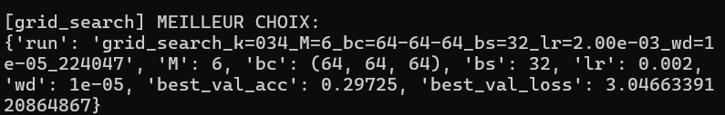

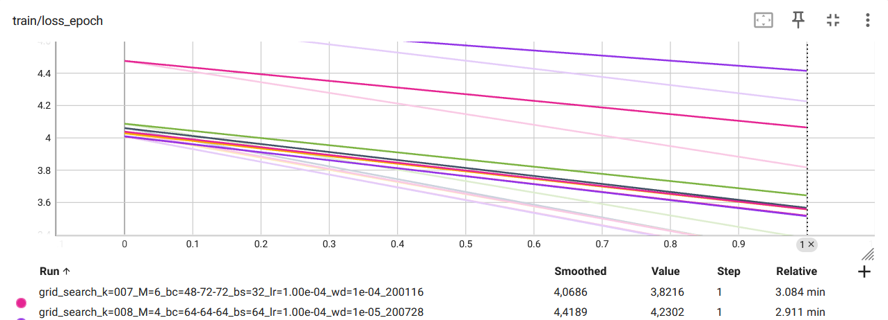

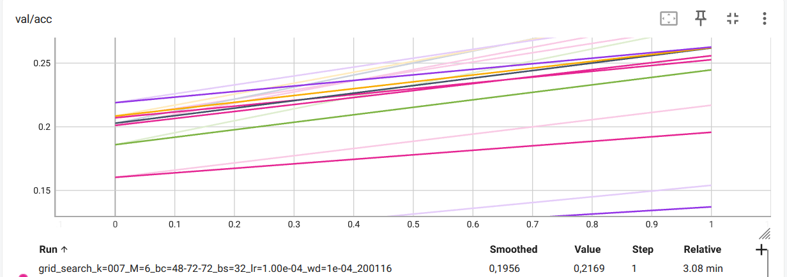

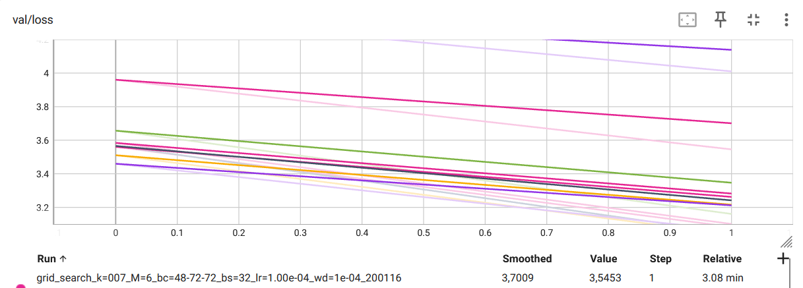


> _Insérer capture TensorBoard (onglet HParams/Scalars) ou tableau récapitulatif._

**M5.** Présentez la **meilleure combinaison** (selon validation) et commentez l’effet des **2 hyperparamètres de modèle** sur les courbes (stabilité, vitesse, overfit).

```

Meilleur run : grid_search_k=034_M=6_bc=64-64-64_bs=32_lr=2.00e-03_wd=1e-05_224047

Hyperparamètres :

- M = 6 et 4

- Branch_channels = (64, 64, 64) et (48, 72, 72)

- Optimisation : LR = 2e-3, WD = 1e-5
- batch_size = 32

Résultat validation : best val acc = 0.2973, best val loss = 3.0466

Effet des 2 hyperparamètres de modèle

- Nombre de modules M (4 et 6) : 
  - Augmenter M rend le modèle plus expressif 
  - On observe en général une meilleure convergence (val acc plus haute) et une descente plus marquée des courbes, au prix d’un risque d’overfit un peu plus élevé si on entraînait plus longtemps. Dans nos runs courts, M=6 domine globalement M=4 en validation.

- Répartition des canaux par branche ((64, 64, 64) et (48, 72, 72)) :
   - elle change la “spécialisation” des branches (plus de capacité sur la branche 3×3 quand on met 72). 
   - Les deux restent proches, mais 64-64-64 est légèrement plus stable et performant sur le meilleur run.
   - Tandis que (48, 72, 72) peut donner des résultats comparables selon le batch size et le LR par exemple certains runs M=6 restent très proches.

```

## 6) Entraînement complet (10–20 époques, sans scheduler)

- **Configuration finale** :
  - LR = `0.002`
  - Weight decay = `1e-5`
  - Hyperparamètre modèle A = `6`
  - Hyperparamètre modèle B = `(64, ,64, 64)`
  - Batch size = `32`
  - Époques = `40` 
- **Checkpoint** : `artifacts/best.ckpt` (selon meilleure métrique val)

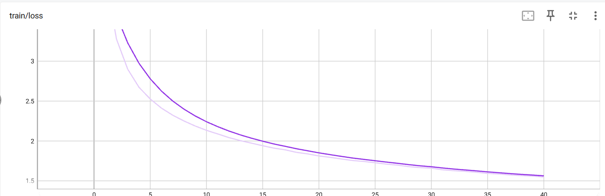

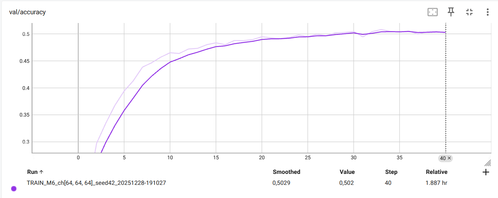

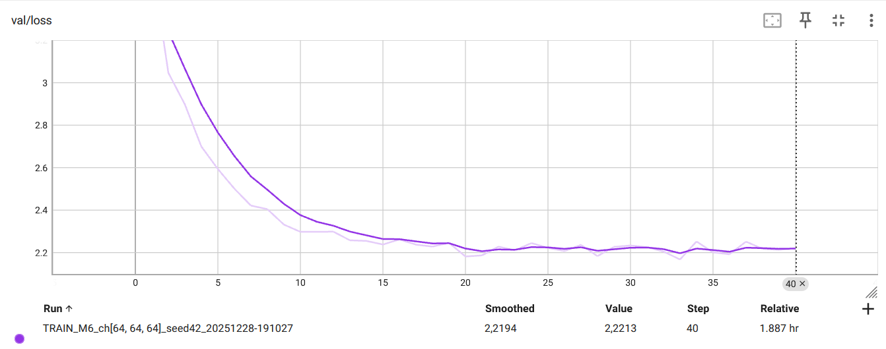


> _Insérer captures TensorBoard :_
> - `train/loss`, `val/loss`
> - `val/accuracy` **ou** `val/f1` (classification)

**M6.** Montrez les **courbes train/val** (loss + métrique). Interprétez : sous-apprentissage / sur-apprentissage / stabilité d’entraînement.
Analyse des courbes :

```

  - train/loss : 
    - baisse de manière régulière de 4.06 vers  1.55, sans oscillations fortes ni remontées brutales.
    - Cela indique un entraînement stable : le LR est bien calibré et l’optimiseur converge correctement donc pas d’instabilité.
  - val/loss :
    - Chute fortement au début avec une amélioration rapide, puis ralentit et se stabilise autour de 2.2
    - Le modèle capte vite les patterns principaux, puis atteint un plateau de généralisation
  - val/accuracy :
    - Augmente rapidement au début dés 0.22 → 0.45 , puis progresse plus lentement et finit en plateau vers 0.51 à la fin d'entrainement.
    - val/accuracy augmente rapidement au début (environ 0.20 → 0.45), puis progresse plus lentement et finit en plateau vers ~0.50–0.51.
    - Convergence correcte, mais la validation atteint une limite ce confirme que le modèle ne généralise plus mieux après presque 30 époques.
- L’entraînement est globalement stable : 
  - La train/loss baisse de manière régulière et la val/loss ne montre pas d’explosion ni d’oscillations anormales. 
  - On n’observe pas de sous-apprentissage, puisque les courbes train et validation s’améliorent nettement au début, ce qui indique que le modèle apprend effectivement.
  - En revanche, on voit un léger sur-apprentissage en fin d’entraînement puisque la train/loss continue de diminuer alors que la val/loss et la val/accuracy        plafonnent.

```

## 7) Comparaisons de courbes (analyse)

> _Superposez plusieurs runs dans TensorBoard et insérez 2–3 captures :_

- **Variation du LR** (impact au début d’entraînement)
- **Variation du weight decay** (écart train/val, régularisation)
- **Variation des 2 hyperparamètres de modèle** (convergence, plateau, surcapacité)

**M7.** Trois **comparaisons** commentées (une phrase chacune) : LR, weight decay, hyperparamètres modèle — ce que vous attendiez vs. ce que vous observez.

```


LR : En diminuant le LR, on s’attend à une convergence plus lente ; ici les deux runs restent stables et quasi superposés sur les 10 premières époques, avec un léger avantage au LR le plus efficace (train/val loss un peu plus bas et val/accuracy un peu plus haute), indiquant une convergence un peu plus rapide sans instabilité.

```

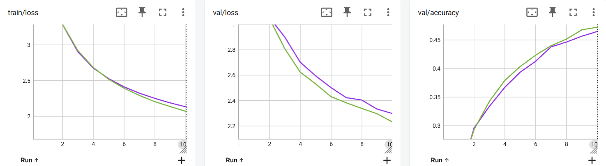

```

WD : Avec un weight decay plus élevé, on s’attend à réduire l’écart train–val ; ici le run orange présente bien un gap plus faible mais des pertes plus hautes et une val/accuracy plus basse (≈0.46 vs ≈0.50), ce qui indique une régularisation trop forte menant au sous-apprentissage.

```

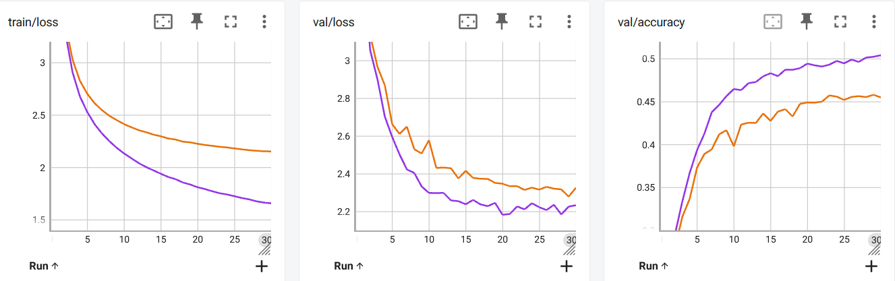

```

Hyper Params:En réduisant la capacité du modèle (M=6 vers M=4), on observe une dégradation claire : train/loss reste plus haut, val/loss plafonne plus haut et val/accuracy plafonne plus bas (0.45 contre 0.50), ce qui indique du sous-apprentissage avec M=4 , tandis que le choix des branch_channels ((64,64,64) contre (48,72,72)) n’apporte qu’un gain marginal.

```


## 8) Itération supplémentaire (si temps)

- **Changement(s)** : `un LR affiné :(1.5e-3, 2.0e-3, 2.5e-3); un WD plus faible :[1e-5, 5e-6, 1e-6] ; les hyperparametres du modèle sont fixés : M=6 et branch_channels[64, 64, 64] et j'ai fais 8 epoques par run pour une totalité de 9 combinaisons` (resserrage de grille, nouvelle valeur d’un hyperparamètre, etc.)
- **Résultat** : `LR=2.0e-3 et WD=1e-6 val/acc ≈ 0.453 ; les courbes montrent que réduire légèrement le WD peut améliorer la validation . ` (val metric, tendances des courbes)


**M8.** Décrivez cette itération, la motivation et le résultat.

```

Pour consolider la zone la plus prometteuse mise en évidence par la première grid search, nous avons mené une itération complémentaire en resserrant l’exploration autour du meilleur combinaison (LR = 2e-3 et  WD = 1e-5). L’idée était de vérifier si de légers ajustements du learning rate et weight decay plus faible pouvaient améliorer la performance de validation sur un entraînement court.

Cette mini-grid (9 combinaisons, 8 époques) confirme que la meilleure région se situe bien autour de LR = 2e-3. Parmi les valeurs testées, WD = 1e-6 donne le meilleur résultat en val/accuracy = 0.4526, légèrement au-dessus des autres variantes, ce qui suggère une régularisation trop forte pénalise un peu la généralisation à ce stade. Cette itération renforce donc le choix d’une configuration finale centrée sur LR = 2e-3, avec un weight decay faible, et montre que la solution reste stable quand on perturbe modérément ces deux hyperparamètres.

```

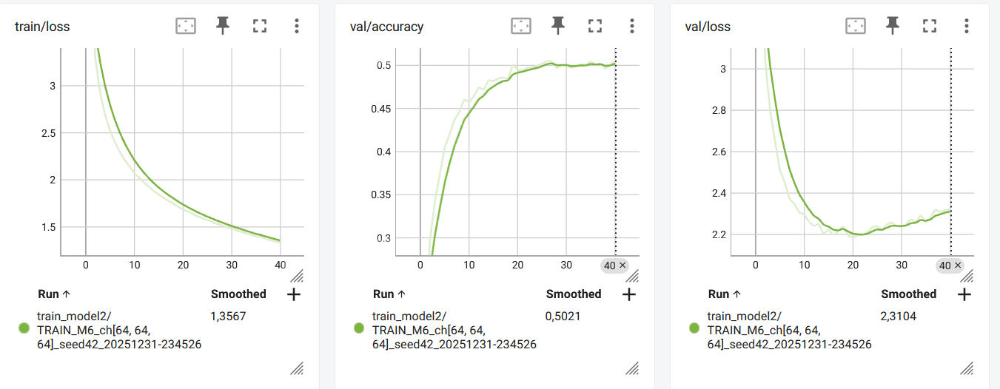


```

Test du deuxième meilleur modèle : 
- j'ai aussi fais une deuxieme run complet avec la deuxième meilleur config apres le premier grid search : LR =1e-3 et WD =1e-5 , M=6 et branch_channels= (64,64,64) :
  - Pour le deuxième entraînement , j’ai relancé un train complet afin de vérifier si cette configuration pouvait rivaliser avec le meilleur modèle. 
  - On observe une train/loss plus faible (le modèle apprend mieux le train), mais sans gain en généralisation 
  - la val/accuracy reste légèrement en dessous et la val/loss est plus élevée que le baseline. 
  - Ce teste confirme donc que cette deuxième configuration a tendance à mieux fitter le train sans améliorer la validation, et le premier modèle demeure le meilleur choix final.

```

---

## 9) Évaluation finale (test)

- **Checkpoint évalué** : `artifacts/best.ckpt`
- **Métriques test** :
  - Metric principale (nom = `accuracy`) : `0.4840`
  - Metric(s) secondaire(s) : `test/loss` : `2.198`

**M9.** Donnez les **résultats test** et comparez-les à la validation (écart raisonnable ? surapprentissage probable ?).

```


l'évaluation du modele sur le split test montre une accuracy de 48% et val/test = 2.2 ; ces performances sont cohérents avec les resulats du split validatipn ( 50% accuracy et val-loss = 2.16 )
interpretation :
l'ecart entre les performances du split test et validation est faible :
val_accuracy =50.7%    /  test_accuracy =48.5% 
val_loss =2.16     /  test_loss =2.198 
La performance sur le test est un peu en dessous de la meilleure validation (0.508), ce qui est attendu : on a choisi le meilleur checkpoint en regardant la validation, donc celle-ci peut être légèrement “optimiste”, et le split test peut être un peu plus difficile.

On ne voit pas de signe de surapprentissage marqué : l’écart reste modéré entre validation et test, et il est cohérent avec les courbes d’entraînement/validation qui se stabilisent sans divergence brutale.

Bilan finale : le modèle finale est stable et généralise correctement sur des données inédites, même si la performance test est légèrement inférieure à la validation.


```

## 10) Limites, erreurs & bug diary (court)

- **Limites connues** (données, compute, modèle) :

```

- Données : Tiny-ImageNet (200 classes)(64,64) ;tache difficile avec la vatriation des images ce que rend l'entrainnement difficile avec seulement 3 couches 
- Modèle : architecture “inception_multibranch” simple, sans scheduler ni techniques avancées (mixup/cutmix/EMA) → performance plafonne autour de 0.50 val acc
- Compute : contraintes d’allocation SLURM (durée limitée) → grid search courte (2–8 epochs) et entraînements complets limités : entrainement fais sur un seul gpu qui empeche le travail sur des modeles plus larges.

```

- **Erreurs rencontrées** (shape mismatch, divergence, NaN…) et 
- **solutions** :

```

- Problème : logs TensorBoard écrasés / difficiles à identifier (surtout en grid search, ou si l’allocation se termine avant la fin)
- Solution : j’ai rendu les noms de runs uniques en ajoutant l’heure (timestamp) dans run_name / log_dir, ce qui évite l’écrasement des anciens logs et facilite le repérage de chaque essai.

- Problème : le meilleur checkpoint est réécrit (artifacts/best.ckpt) lors de plusieurs entraînements
- Solution : j’ai sauvegardé les checkpoints avec un nom lié à la config/run par exemple (best_model2.ckpt) et dans des sous-dossiers dédiés (artifacts/Gridsearch/)

avec un snapshot YAML associé pour garder une traçabilité claire.

```

- **Idées « si plus de temps/compute »** (une phrase) :

```

- Tester un scheduler (cosine/onecycle) + régularisation/augmentations plus fortes (label smoothing, mixup/cutmix) et augmenter la capacité du modèle, puis refaire une recherche fine sur learning rate.

```


## 11) Reproductibilité

- **Seed** : `42`
- **Config utilisée** : joindre un extrait de `configs/config.yaml` (sections pertinentes)

```

dataset:

  name: "zh-plus/tiny-imagenet" 

  root: "./data"            
  
  split:                    
  
    train: "train"
  
    val: 8000
  
    test: 2000
  
  download: true            
  
  num_workers: 4
  
  shuffle: true


preprocess:
  
  resize: [64, 64]                 
  
  normalize:          
  
    mean: [0.485, 0.456, 0.406]
  
    std: [0.229, 0.224, 0.225]       
  
  text_tokenizer:           

augment:
  
  random_flip: true    
          
  
  random_crop:       
    
    size: 64
    
    padding: 4       
  
  color_jitter:    
  
    brightness: 0.1
  
    contrast: 0.1
  
    saturation: 0.1
  
    hue: 0.02         


model:
  
  type: "inception_multibranch"              
  
  num_classes: 200
  
  input_shape: [3, 64, 64]
  
  num_modules: 6
  
  branch_channels: [64, 64, 64]        
  
  hidden_sizes: null             
  
  activation: relu          
  
  dropout: 0.0              
  
  batch_norm: true         
  
  residual: false           
  
  attention: false          
  
  rnn: null                      

train:
  
  seed: 42
  
  device: auto              
  
  batch_size: 32
  
  epochs: 40
  
  max_steps: null          
  
  overfit_small: false 
  
  overfit_size: 32    

  optimizer:
  
    name: adam              
  
    lr: 0.002
  
    weight_decay: 0.00001
  
    momentum: 0.9           

  scheduler:
  
    name: none              
  
    step_size: 10
  
    gamma: 0.1
  
    warmup_steps: 0

metrics:
  
  classification:           
  
    - accuracy
  
  regression: []            

hparams:          

  epochs: 2          

  lr: [0.0001, 0.001, 0.002]

  batch_size: [32, 64]

  weight_decay: [0.00001, 0.0001]

  num_modules: [4, 6]

  branch_channels:

    - [64, 64, 64]

    - [48, 72, 72]

  tag: "grid_search"

paths:

  runs_dir: "./runs"

  artifacts_dir: "./artifacts"


```


- **Commandes exactes** :

```bash
# Exemple (remplacer par vos commandes effectives)
`overfit small`
python -m src.train --config configs/config.yaml --overfit_small
`lr finder`
python -m src.lr_finder --config configs/config.yaml
`grid search`
python -m src.grid_search --config configs/config.yaml
`Train complet`
python -m src.train --config configs/config.yaml
`grid search refined (M8)`
python -m src.grid_search --config configs/config.yaml --refined
`train 2eme modèle`
python -m src.evaluate --config configs/config1.yaml --checkpoint artifacts/best_model2.ckpt
`comparaison M7`
python -m src.compare_runs --config configs/config.yaml
`Evaluation`
python -m src.evaluate --config configs/config.yaml --checkpoint artifacts/best.ckpt


````

* **Artifacts requis présents** :

  * [ ] `runs/` (runs utiles uniquement)
  * [ ] `artifacts/best.ckpt`
  * [ ] `configs/config.yaml` aligné avec la meilleure config

---

## 12) Références (courtes)

* PyTorch docs des modules utilisés (Conv2d, BatchNorm, ReLU, LSTM/GRU, transforms, etc.).
* Lien dataset officiel (et/ou HuggingFace/torchvision/torchaudio).
* Toute ressource externe substantielle (une ligne par référence).


